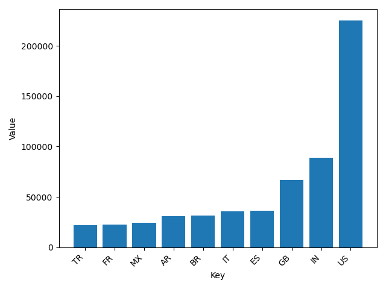
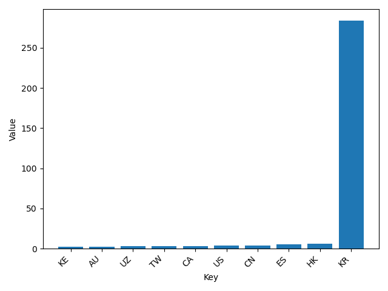
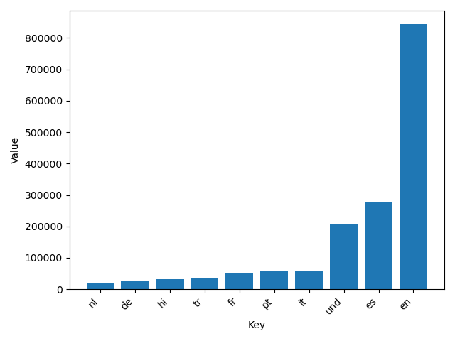
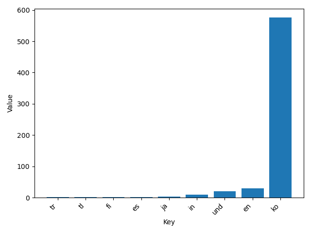
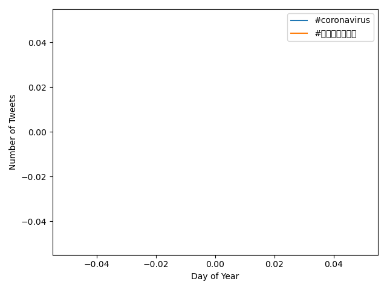

# Twitter Coronavirus MapReduce Analysis

This project uses Python and the MapReduce programming model to analyze a large collection of geotagged tweets from 2020. The mapper processes tweets in parallel and tracks coronavirus-related hashtags by both language and country. The reducer then combines the daily results into aggregate datasets.

I also modified the visualization code to generate bar charts showing the top 10 languages or countries associated with selected hashtags. The results are sorted from low to high for readability.

## Visualizations

### #coronavirus by Country

### #코로나바이러스 by Country

### #coronavirus by Language

### #코로나바이러스 by Language

## Alternative Reduce

For the alternative reduce task, I created `alternative_reduce.py`. Instead of producing one aggregate result, it scans the daily MapReduce outputs and constructs a time-series dataset. It then generates a line plot showing the number of tweets using each requested hashtag for each day of the year.

## Skills Demonstrated

- Python
- MapReduce
- Large-scale data processing
- JSON data processing
- Data aggregation
- Multilingual text processing
- Matplotlib data visualization
- Time-series analysis
- Linux command-line tools
- Git and GitHub
